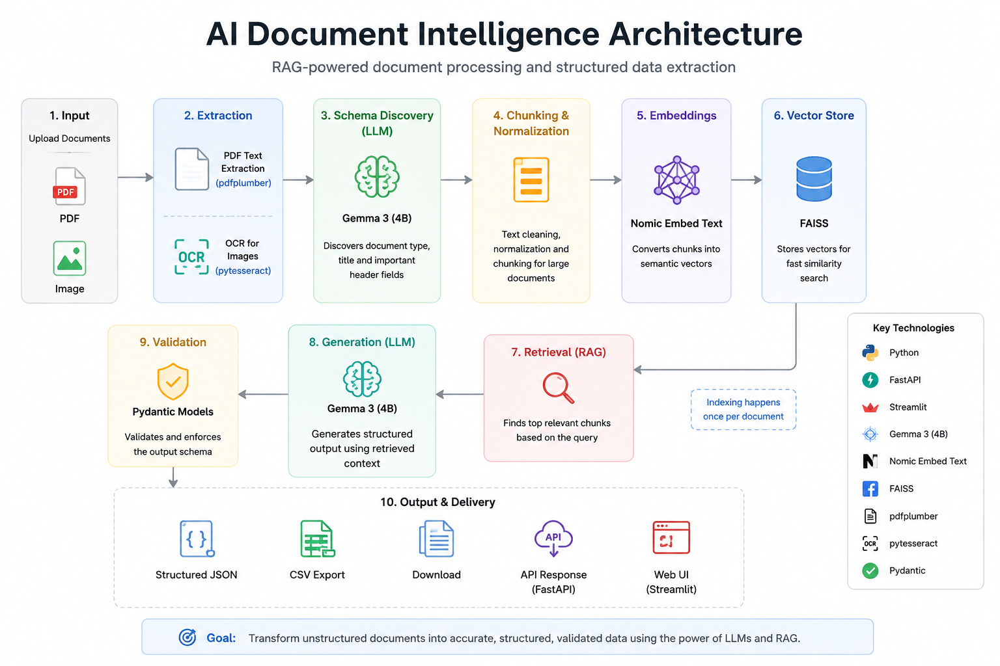
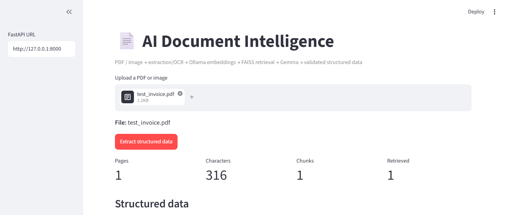
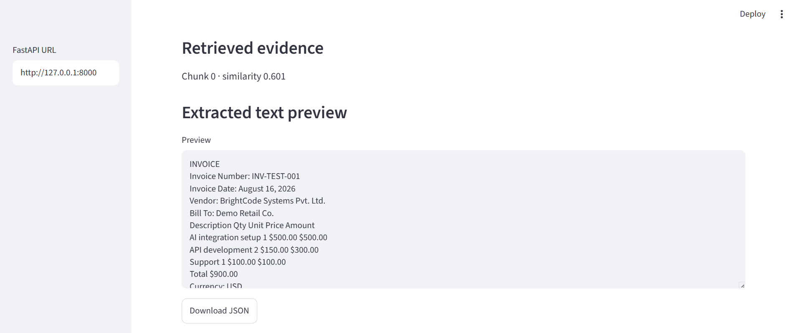
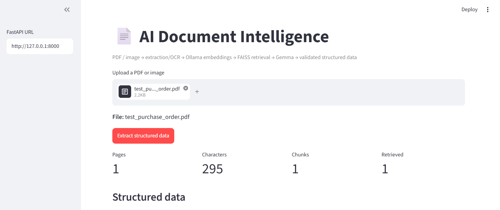

# 📄 AI Document Intelligence

> **RAG-powered document intelligence system that converts business PDFs into structured, validated data using Ollama, Gemma 3, Nomic embeddings, FAISS, FastAPI, and Streamlit.**

AI Document Intelligence is a local GenAI application for processing business documents and extracting useful structured information from unstructured PDFs.

The system combines **document text extraction, dynamic document-structure discovery, semantic retrieval, local embeddings, FAISS vector search, LLM-powered extraction, and Pydantic validation** into an end-to-end pipeline.

---

## 🚀 What It Demonstrates

- PDF text extraction with `pdfplumber`
- OCR support for image inputs with `pytesseract`
- Text cleaning and chunking
- Dynamic document structure/header discovery
- Embeddings with Ollama `nomic-embed-text`
- Vector retrieval with FAISS
- Structured extraction using Ollama `gemma3:4b`
- JSON-constrained LLM output
- Truncated-JSON recovery for local LLM responses
- Pydantic validation
- FastAPI backend
- Streamlit demo UI

---

## 🧪 Supported Test Documents

The current implementation has been successfully tested with five small business-document examples:

| Document Type | Result |
|---|---|
| Invoice | ✅ |
| Purchase Order | ✅ |
| Payment Receipt | ✅ |
| Delivery Note | ✅ |
| Service Agreement | ✅ |

The goal is to process different business-document formats using a common AI pipeline rather than a single hard-coded invoice workflow.

---

## 🏗️ Architecture



### Pipeline

```text
PDF / Image
    ↓
Text Extraction
    ├── PDF → pdfplumber
    └── Image → pytesseract OCR
    ↓
Text Cleaning + Normalization
    ↓
Dynamic Document Structure Discovery
    ↓
Chunking
    ↓
nomic-embed-text
    ↓
FAISS Vector Index
    ↓
Semantic Retrieval
    ↓
Gemma 3 4B
    ↓
Structured JSON
    ↓
Pydantic Validation
    ↓
FastAPI API / Streamlit UI
```

---

## 🔎 How It Works

### 1. Document ingestion

The application accepts supported PDF and image files.

### 2. Text extraction

For text-based PDFs, the system extracts text using `pdfplumber`.

For image inputs, OCR can be performed using `pytesseract`.

### 3. Dynamic document structure discovery

The system analyzes the beginning/header section of a document and identifies:

- document type
- document title
- important header fields
- field values
- confidence scores

This allows the application to recognize different document structures instead of assuming every document is an invoice.

### 4. Semantic indexing

Extracted text is cleaned and divided into chunks.

Each chunk is converted into an embedding using:

```text
nomic-embed-text
```

The embeddings are stored in an in-memory FAISS index.

### 5. Retrieval

A semantic query is embedded and the most relevant document chunks are retrieved.

The retrieved chunks are passed to the extraction model as grounded context.

### 6. LLM-powered extraction

The retrieved context is passed to:

```text
gemma3:4b
```

through Ollama.

The model is instructed to return structured JSON using the application's extraction schema.

### 7. Validation and recovery

The generated response is:

1. Parsed as JSON.
2. Recovered when a local LLM truncates closing braces.
3. Validated against the Pydantic extraction model.

This helps the local CPU-based model produce reliable application output even when its response is not perfectly formatted.

---

---

## 🖥️ Demo

### Main Application



The main interface demonstrates document upload, processing, and structured extraction output through the Streamlit application.

### RAG Retrieval



The retrieval view shows the relevant document chunks and similarity scores used to ground the LLM extraction.

### Multi-Document Support



The application was tested across multiple document types including invoices, purchase orders, receipts, delivery notes, and service agreements.

## 📦 Example Structured Output

For an invoice:

```json
{
  "vendor_name": "BrightCode Systems Pvt. Ltd.",
  "buyer_name": "Demo Retail Co.",
  "document_number": "INV-TEST-001",
  "document_date": "August 16, 2026",
  "currency": "USD",
  "total_amount": 900.0,
  "line_items": [
    {
      "description": "AI integration setup",
      "quantity": 1.0,
      "unit_price": 500.0,
      "amount": 500.0
    },
    {
      "description": "API development",
      "quantity": 2.0,
      "unit_price": 150.0,
      "amount": 300.0
    },
    {
      "description": "Support",
      "quantity": 1.0,
      "unit_price": 100.0,
      "amount": 100.0
    }
  ],
  "confidence_notes": []
}
```

---

## 🛠️ Tech Stack

| Layer | Technology |
|---|---|
| Language | Python |
| PDF Extraction | pdfplumber |
| OCR | pytesseract |
| LLM Runtime | Ollama |
| LLM | Gemma 3 4B |
| Embeddings | nomic-embed-text |
| Vector Search | FAISS |
| Validation | Pydantic |
| Backend | FastAPI |
| Frontend | Streamlit |

---

## 📁 Project Structure

```text
ai-document-intelligence/
│
├── app/
│   ├── main.py
│   ├── schemas.py
│   │
│   └── services/
│       ├── llm_client.py
│       ├── ollama_client.py
│       ├── pipeline.py
│       ├── rag_retriever.py
│       ├── text_extractor.py
│       └── text_processing.py
│
├── frontend/
│   └── streamlit_app.py
│
├── tests/
│
├── test_documents/
│   ├── test_invoice.pdf
│   ├── test_purchase_order.pdf
│   ├── test_receipt.pdf
│   ├── test_delivery_note.pdf
│   └── test_service_agreement.pdf
│
├── docs/
│   ├── architecture.png
│   └── screenshots/
│       └── app-main.png
│
├── .env.example
├── .gitignore
├── requirements.txt
└── README.md
```

---

## ⚙️ Setup

### 1. Clone the repository

```bash
git clone https://github.com/rohanhgohil/ai-document-intelligence.git
cd ai-document-intelligence
```

### 2. Create a virtual environment

```bash
python -m venv .venv
```

Windows PowerShell:

```powershell
.venv\Scripts\Activate.ps1
```

### 3. Install dependencies

```bash
pip install -r requirements.txt
```

### 4. Install and configure Ollama

Install Ollama and make sure it is running.

Download the required models:

```bash
ollama pull gemma3:4b
ollama pull nomic-embed-text
```

Verify:

```bash
ollama list
```

### 5. Configure environment variables

Copy:

```text
.env.example
```

to:

```text
.env
```

Example:

```env
OLLAMA_BASE_URL=http://localhost:11434
OLLAMA_LLM_MODEL=gemma3:4b
OLLAMA_EMBED_MODEL=nomic-embed-text
OLLAMA_TIMEOUT=120
OLLAMA_KEEP_ALIVE=30m
```

**Do not commit `.env` to GitHub.**

---

## ▶️ Run the Application

### Start FastAPI

```bash
uvicorn app.main:app --reload --port 8000
```

API:

```text
http://127.0.0.1:8000
```

Swagger documentation:

```text
http://127.0.0.1:8000/docs
```

### Start Streamlit

In another terminal:

```bash
streamlit run frontend/streamlit_app.py
```

---

## 🧪 Example API Request

```bash
curl -X POST "http://127.0.0.1:8000/extract" \
  -F "file=@test_documents/test_invoice.pdf"
```

The API returns:

- document metadata
- extracted text preview
- retrieved chunk information
- structured extraction results
- validated JSON data

---

## ✅ Validation Performed

The current implementation has been tested successfully with five small business-document examples:

- **Invoice**
- **Purchase Order**
- **Payment Receipt**
- **Delivery Note**
- **Service Agreement**

The tests demonstrate that the same RAG + LLM architecture can process different document formats without creating a separate application for each format.

---

## ⚠️ Current Limitations

The current MVP is optimized for **small and moderately sized, text-extractable documents**.

**Local LLM inference can be slow on CPU-only systems, especially for larger documents.**

Large OCR-heavy or poorly encoded PDFs can produce low-quality native PDF text. A 31-page OCR-heavy test document used during development produced garbled native PDF text and is therefore not yet handled reliably by the current native-extraction path.

The next iteration will add a dedicated OCR fallback and page-aware processing strategy for these documents.

The current implementation therefore focuses on proving the core:

```text
Document → Retrieval → LLM → Structured Data
```

pipeline reliably on representative small business documents.

---

## 🗺️ Roadmap

### v0.3 — Document Robustness

- [ ] Automatic PDF text-quality detection
- [ ] OCR fallback for scanned/poorly encoded PDFs
- [ ] Page-aware retrieval
- [ ] Large-document processing
- [ ] Better error handling

### v0.4 — Extraction Intelligence

- [ ] Dynamic extraction schemas
- [ ] Field-level confidence scoring
- [ ] Field validation and normalization
- [ ] Improved table extraction
- [ ] Document classification

### v0.5 — Productionization

- [ ] Batch document processing
- [ ] Persistent vector storage
- [ ] Background processing
- [ ] Database-backed document history
- [ ] Authentication
- [ ] Docker deployment
- [ ] Cloud deployment

---

## 🎯 Portfolio Positioning

**AI Document Intelligence | RAG → Document Understanding → LLM Extraction → Structured Data**

This project demonstrates practical GenAI engineering using:

- Retrieval-Augmented Generation
- Local LLM inference
- Semantic search
- Vector databases
- Document processing
- Dynamic document structure discovery
- Structured LLM output
- Python backend development
- FastAPI
- Streamlit

The goal is to demonstrate how GenAI can be applied to real business-document workflows rather than building a generic chatbot.

---

## 👤 Author

**Rohan Gohil**

AI / GenAI Engineer focused on:

**RAG · Document AI · LLM Applications · AI Automation**
